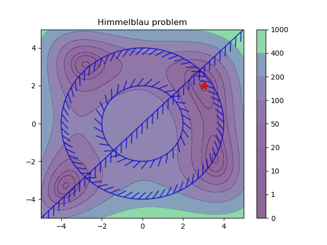
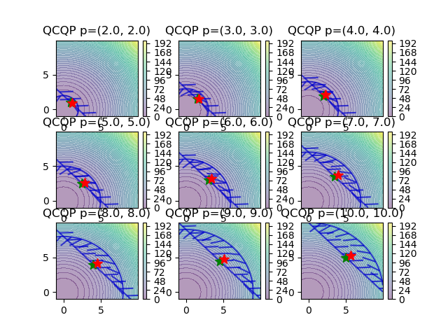
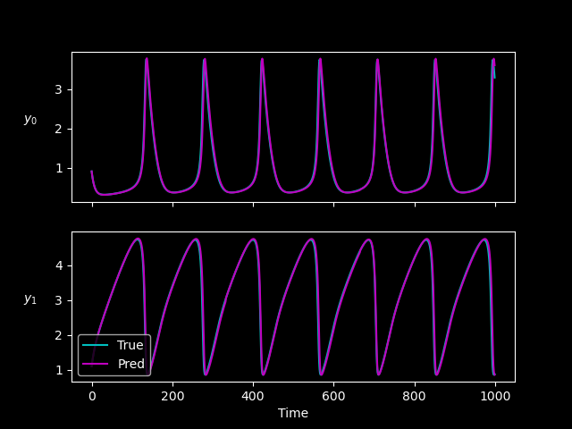
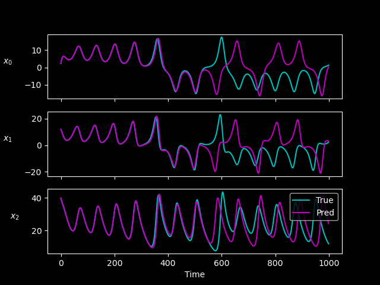
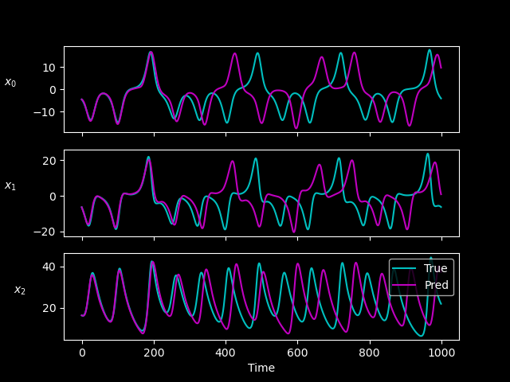
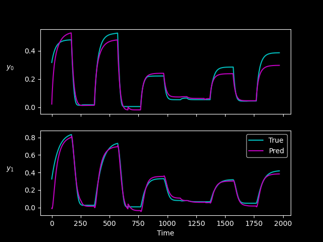

# NeuroMANCER code examples

## Files

Here we list the file tree and plots of expected results from the default parameters of the example scripts

+ **control**/ 
    + double_integrator_dpc.py: Stabilizing control for a double integrator system. 
+ **figs**/ Plots of expected results displayed below for the respective scripts that generated them. 
+ **parametric_programming**/ Scripts for various types of differentiable constrained optimization of parametric programs
    + mpNLP_Himmelblau_nm.py: Solve the Himmelblau problem, formulated as the NLP using Neuromancer
        - 
    + mpQP_nm_2.py: Multi-parametric Quadratic Programming (mpQP) problem using Neuromancer.
        - 
    + mpLP_nm_1.py: Solve Linear Programming (LP) problem using Neuromancer.
        - 
    + mpNLP_GomezLevy_nm.py: Solve the Gomez and Levy function problem, formulated as the NLP using Neuromancer.
        - 
    + mpNLP_StyblinskiTang_nm.py: Solve the Styblinski–Tang problem, formulated as the NLP using Neuromancer.
        -    
    + mpQP_nm_1.py: Multi-parametric Quadratic Programming (mpQP) problem using Neuromancer
        - 
    + mpNLP_Rosenbrock_nm.py: Solve the Rosenbrock problem, formulated as the NLP using Neuromancer
        -    
    + mpQCQP_nm_1.py: Multi-parametric quadratically constrained quadratic program (mpQCQP) problem using Neuromancer
        - 
+ **system_identification/** This folder has scripts system identification of autonomous and nonautonomous systems
    - **boxes.pkl**: Pickle file with reasonable bounds for initial conditions for the chaotic systems. 
    - **brusselator_parameter.py**: Parameter estimation for a 1D Brusselator system.
        + 
    - **lorenz_control_node_curriculum.py**: Modeling Lorenz system 
      with additional stabilizing additive control using neural ODEs and curriculum learning. 
        + 
    - **lorenz_node_curriculum.py**: Modeling Lorenz system 
       using neural ODEs and curriculum learning. 
       + 
    - **duffing_parameter.py**: Parameter estimation of Duffing ODE system.
        + 
    - **two_tank_node.py**: Modeling a Two Tank system with neural ODEs
        + 
    - **two_tank_neural_ssm.py**: Modeling a two tank system with a neural state space model. 
        + 
+ **tutorials**/
    - component_tutorial.py: Example code of working with the Neuromancer Component class          
    - constraints_tutorial.py: Example code for easy formulation of objectives and constraints usint the Neuromancer Variable and Constraint classes.  
    - graph_timestepper_tutorial.py: Example code of system identification using the Neuromancer graph timestepper.   
    - linear_regression.py: Example code using new Neuromancer Variable class to solve a simple linear regression problem
    - component_tutorial_interactive.py: Example code of working with the Neuromancer Component class 
    - dataset_tutorial.py: Example code of using Neuromancer built in data loading code using pytorch Datasets and Dataloaders
    - integrators_vs_psl_auto.py: Comparison of neuromancer numerical integration implementation with PSL simulations using scipy's odeint solver
    - toy_interpolation.py: Use of control action interpolation with neuromancer neural ODEs

